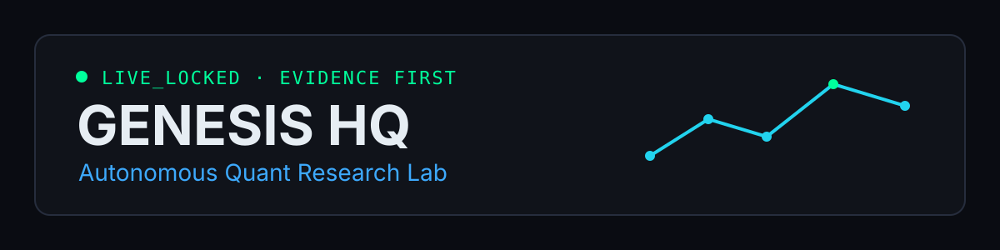

# Genesis HQ

<p align="center">
  
</p>

<p align="center">
  <strong>An evidence-first autonomous quantitative research lab.</strong><br/>
  Genesis searches for trading edge, tries to falsify it, measures it after costs, and keeps real execution locked until evidence survives.
</p>

<p align="center">
  
  
  
  
</p>

<p align="center">
  <a href="https://genesis-hq-lab.vercel.app">Live HQ</a> ·
  <a href="./docs/ARCHITECTURE_PUBLIC.md">Architecture</a> ·
  <a href="./docs/RESEARCH_PRINCIPLES.md">Research principles</a> ·
  <a href="./docs/ROADMAP_PUBLIC.md">Roadmap</a> ·
  <a href="./docs/REPRODUCIBILITY.md">Reproducibility</a> ·
  <a href="https://github.com/Blackleets/genesis-hq-lab/actions/workflows/institutional-edge-stack.yml">Latest research run</a> ·
  <a href="./CONTRIBUTING.md">Contribute</a>
</p>

> **Current safety state:** `LIVE_LOCKED` / paper-shadow research only.  
> Genesis does **not** claim a proven profitable live edge today.

---

## Why Genesis exists

Most trading repositories optimize for activity:

`signal -> order -> backtest chart`

Genesis optimizes for **evidence**:

```text
real market data
      ↓
edge hypothesis
      ↓
research / replay / shadow
      ↓
costs + slippage + fill realism
      ↓
walk-forward / OOS / holdout
      ↓
economic truth gates
      ↓
PAPER / SHADOW
      ↓
LIVE_LOCKED
```

The goal is not to make a bot look busy. The goal is to determine whether an edge is real enough to deserve capital.

## What Genesis contains today

| Research lane | What it studies | Execution state |
|---|---|---|
| **Futures research** | systematic trend, breakout, mean-reversion, regime and forward-paper studies | Paper only |
| **DEX / MEV arbitrage** | same-block route economics, liquidity, simulation, inclusion and failure costs | Shadow only |
| **Maker microstructure** | queue-aware fills, microprice, depth imbalance, adverse selection and inventory risk | Research only |
| **Cross-market research** | lead/lag, positioning, funding, taker flow and derivatives context | Research only |
| **Validation layer** | OOS, walk-forward, holdouts, protocol locks, kill criteria and economic accounting | Enforced before promotion |
| **Agent layer** | automated research, diagnostics, reporting and orchestration | No autonomous real-capital authority |

Genesis deliberately allows a strategy to fail. A clean rejection is a useful research result.

## A different definition of "working"

A candidate is not considered good because it:

- has a high backtest return;
- generated many trades;
- found a large gross spread;
- touched a hypothetical maker order;
- produced an impressive chart.

It becomes interesting only when it survives **net economics** and **forward evidence**.

Examples of things Genesis explicitly models or gates:

- trading fees and route costs;
- slippage reserves;
- failed-attempt cost;
- quote freshness;
- liquidity confidence;
- queue coverage;
- empirical fill probability;
- adverse selection;
- inventory risk;
- drawdown;
- walk-forward / out-of-sample behavior;
- holdout discipline.

## Architecture

```text
                           GENESIS HQ
                              │
                    ┌─────────┴─────────┐
                    │                   │
              Research Surface     Backend / Agents
                    │                   │
        ┌───────────┼───────────┐       │
        │           │           │       │
     Futures    Arbitrage    Microstructure
        │           │           │
        └───────────┴─────┬─────┘
                          │
                 ECONOMIC TRUTH LAYER
                          │
       costs · fills · slippage · risk · evidence
                          │
              walk-forward · OOS · holdout
                          │
                  PAPER / SHADOW ONLY
                          │
                     LIVE_LOCKED
```

For the deeper module map, data boundaries and extension points, see
[docs/ARCHITECTURE_PUBLIC.md](./docs/ARCHITECTURE_PUBLIC.md).

## Recent microstructure work

Genesis includes a conservative maker-research lane that avoids one of the most common paper-trading errors: assuming that **price touch = fill**.

`maker_microstructure_shadow_v1` requires measured queue coverage and empirical calibration before it can emit a shadow candidate. The OKX RPI research path captures:

- best bid / ask and best-level queue size;
- microprice and microprice skew;
- depth at 10 / 25 / 50 bps;
- depth imbalance;
- order-count imbalance;
- synchronized aggressive taker flow.

Unknown fill probability, adverse selection, stale evidence or impossible spread capture fails closed to `NO_GO`.

## Quick start

### Requirements

- Node.js 20.19+ or 22.12+ (Node 24 is the recommended contributor runtime)
- npm
- Git

### Run the local HQ

```bash
git clone https://github.com/Blackleets/genesis-hq-lab.git
cd genesis-hq-lab
npm install
cp .env.example .env
npm run start:ui
```

Open the Vite URL shown in the terminal.

Windows PowerShell:

```powershell
Copy-Item .env.example .env
npm run start:ui
```

No private key is required for the read-only / paper research surface.

### Run the full paper stack

```bash
npm run start
```

### Verify the codebase

```bash
npm run test
npm run typecheck
npm run build
```

Focused MEV / arbitrage checks:

```bash
npm run mev:shadow:test
```

## Safety contract

Genesis is intentionally difficult to promote to real money.

- `live_mode = false` is the default project contract.
- Current MEV and maker-microstructure lanes have no signing authority.
- Do not commit API keys, private keys, seed phrases or `.env`.
- Public wallet addresses may be used for read-only observation only where explicitly documented.
- Missing evidence must degrade to `NO_GO`, not a guessed value.
- A UI must never present fabricated market or trading data as live.

Read [AGENTS.md](./AGENTS.md) before making changes.

## Contributing

Contributors are welcome in areas where evidence quality improves without weakening the safety boundary.

Good contribution categories:

- new read-only market-data adapters;
- new research hypotheses with predeclared evaluation rules;
- realistic transaction-cost or fill models;
- replay and data-quality tooling;
- statistical validation;
- observability;
- tests for fail-closed behavior;
- documentation and reproducibility.

Start with [CONTRIBUTING.md](./CONTRIBUTING.md). For evidence conventions and replay discipline, see [docs/EVIDENCE_SCHEMA.md](./docs/EVIDENCE_SCHEMA.md) and [docs/REPRODUCIBILITY.md](./docs/REPRODUCIBILITY.md).

A useful contribution should answer at least one of these questions:

1. **What market behavior are we measuring?**
2. **What evidence would falsify the hypothesis?**
3. **What costs or execution assumptions could erase the edge?**
4. **How will this be tested forward, OOS or on a sealed holdout?**

## Project map

```text
genesis-hq-lab/
├── AGENTS.md                  # mandatory AI / contributor safety rules
├── src/                       # React/Vite HQ and local research surfaces
├── server/
│   ├── genesis/               # quant, MEV, microstructure and evidence engines
│   ├── crypto/                # crypto/futures research and paper systems
│   ├── research/              # research studies and locked protocols
│   └── tests/                 # regression and economic-safety tests
├── supabase/                  # persistence / scheduled infrastructure
├── .github/workflows/         # research capture, validation and deployment CI
├── docs/
│   ├── ARCHITECTURE_PUBLIC.md
│   ├── EVIDENCE_SCHEMA.md
│   ├── REPRODUCIBILITY.md
│   ├── RESEARCH_PRINCIPLES.md
│   ├── ROADMAP_PUBLIC.md
│   ├── VISION.md
│   └── DESIGN_DIRECTION.md
└── LICENSE
```

## Research philosophy

**Evidence > activity.**

Genesis should be allowed to say:

- `INSUFFICIENT_DATA`
- `NO_GO`
- `REJECTED`
- `EDGE_NOT_PROVEN`

Those are not failures of the platform. They are how the platform avoids lying to itself.

The project becomes economically interesting only when an edge remains positive after realistic costs, survives forward evidence, and remains stable enough to justify further validation.

## Public roadmap

The near-term focus is deliberately narrow:

1. improve reproducible evidence capture;
2. calibrate maker fill probability and adverse selection from observed data;
3. strengthen cross-venue arbitrage economics;
4. publish machine-readable economic scoreboards;
5. make research modules easier for external contributors to extend;
6. keep real-capital execution locked until promotion criteria are satisfied.

See [docs/ROADMAP_PUBLIC.md](./docs/ROADMAP_PUBLIC.md).

## Live research evidence

The scheduled **Genesis Institutional Edge Stack** publishes a human-readable GitHub Actions summary plus downloadable machine-readable artifacts on each completed research run.

The summary exposes:

- qualified research sleeves and paper cash reserve;
- smart-execution decision (`WAIT`, `MAKE` or `TAKE`);
- maker-market-making expectancy and fill evidence;
- statistical-arbitrage OOS status;
- funding-carry OOS status;
- Solana-liquidity research eligibility.

[Open the latest Institutional Edge Stack runs](https://github.com/Blackleets/genesis-hq-lab/actions/workflows/institutional-edge-stack.yml).

These are research/paper measurements. They are **not live PnL** and are not presented as proof of profitability.

## Production

Public HQ: https://genesis-hq-lab.vercel.app

Deployment and optional backend configuration are documented in [DEPLOY.md](./DEPLOY.md).

## License

Genesis HQ is currently **source-available under Business Source License 1.1**, with the additional-use grant and Change Date defined in [LICENSE](./LICENSE).

It is not being described as OSI open source before the Change Date. Personal, educational, research and other non-commercial use is covered by the current grant; commercial use is governed by the license terms.

---

<p align="center"><strong>Build less theater. Measure more truth.</strong></p>
